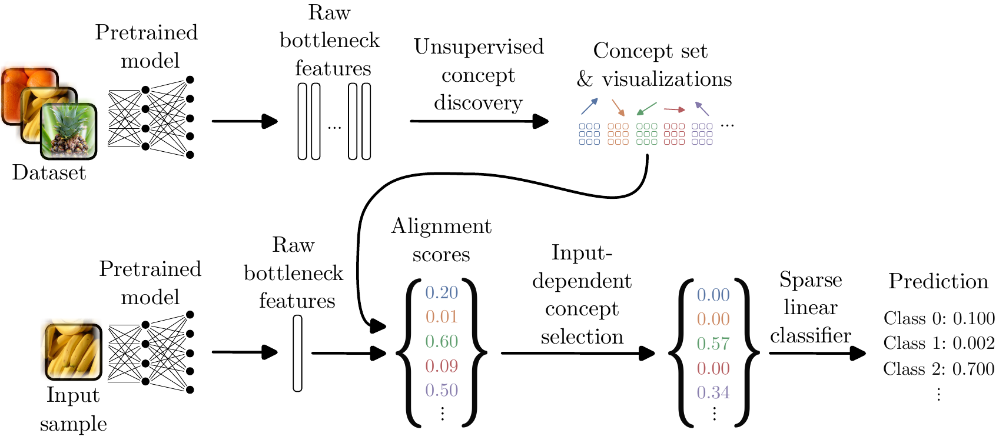

# Selective Concept Bottlenecks Without Predefined Concepts (TMLR 2025)

Official code for our paper ["Selective Concept Bottlenecks Without Predefined Concepts"](https://openreview.net/forum?id=PMO30TLI4l) (TMLR 2025).

If you find this work useful, please consider citing our work:
```bibtex
@article{schrodi2025selective,
    title={Selective Concept Bottlenecks Without Predefined Concepts},
    author={Schrodi, Simon and Schur, Julian and Argus, Max and Brox, Thomas},
    journal={Transactions on Machine Learning Research},
    year={2025}
}
```

Here is an overview of our method, UCBM:



## Setup

1. Install the conda environment, via `conda env create --name ucbm --file env.yml`

2. call `conda develop .`

3. set the base path in `constants.py` (this is where everything will be saved) and the other paths if necessary.

4. Download the models following the instructions from [Trustworthy-ML-Lab/Label-free-CBM](https://github.com/Trustworthy-ML-Lab/Label-free-CBM/tree/main) and adjust the paths in `constants.py` if necessary. 

5. Download the CUB dataset with `bash download_cub.sh`

## Training of UCBMs

### Step 1: Discover concepts

ImageNet:
```bash
python discover_concepts.py -d imagenet -b resnet_v2 --con_am 3
```

CUB:
```bash
python discover_concepts.py -d cub -b cub_rn18 --con_am 1
```

Places-365:
```bash
python discover_concepts.py -d places365 -b places365_rn18 --con_am 5
```

### Step 2: Train interpretable classifier

ImageNet:
```bash
python train_cbm.py -d imagenet -b resnet_v2 --concept_data "concepts_3000_64" --epochs 20 --lam_gate 0 --lam_w 1e-4 --dropout_p 0.1 --lr 0.001 --cls_save_name "topk_seed_0" --scale_choose 'no' --bias_choose 'learn' --normalize_concepts --relu 'no' --k 42 --seed 0
```

CUB:
```bash
python train_cbm.py -d cub -b cub_rn18 --concept_data "concepts_200_64" --epochs 20 --lam_gate 0 --lam_w 8e-4 --dropout_p 0.2 --lr 0.001 --cls_save_name "topk_seed_0" --scale_choose 'no' --bias_choose 'learn' --normalize_concepts --relu 'no' --k 66 --seed 0
```

Places-365:
```bash
python train_cbm.py -d places365 -b places365_rn18 --concept_data "concepts_1825_64" --epochs 20 --lam_gate 0 --lam_w 4e-4 --dropout_p 0.2 --lr 0.01 --cls_save_name "topk_seed_0" --scale_choose 'no' --bias_choose 'learn' --normalize_concepts --relu 'no' --k 162 --seed 0
```

## Visualization of explanations

`cbm_name` is the defined cls_save_name from above with a timestamp.

Plot explanations of individual decisions:
```bash
python explanation/prediction.py -d imagenet -b resnet50_v2 -c concepts_3000_64 --cbm_name $cbm_name
```

Plot explanations of class:
```bash
python explanation/class.py -d imagenet -b resnet50_v2 -c concepts_3000_64 --cbm_name $cbm_name
```

## Acknowledgements

We thank the following GitHub users for their contributions which are used in this repository:

* CRAFT from [deel-ai/Craft](https://github.com/deel-ai/Craft)
* Base cpu NMF implemenation [scikit-learn/scikit-learn](https://github.com/scikit-learn/scikit-learn/tree/main)